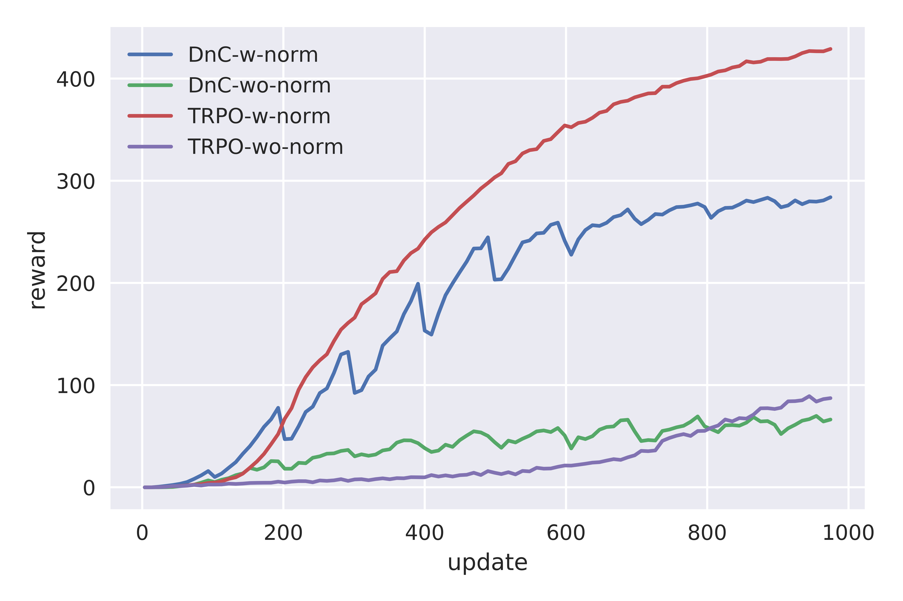

# Divide-and-Conquer Reinforcement Learning in Tensorflow

As part of the implementation series of [Joseph Lim's group at USC](http://www-bcf.usc.edu/~limjj), our motivation is to accelerate (or sometimes delay) research in the AI community by promoting open-source projects. To this end, we implement state-of-the-art research papers, and publicly share them with concise reports. Please visit our [group github site](https://github.com/gitlimlab) for other projects.

This project is implemented by [Youngwoon Lee](https://github.com/youngwoon) and the codes have been reviewed by [Shao-Hua Sun](https://github.com/shaohua0116) before being published.

## Description

This repo is a [Tensorflow](https://www.tensorflow.org/) implementation of DnC RL on a manipulation task: [Divide-and-Conquer Reinforcement Learning](https://openreview.net/forum?id=rJwelMbR-).

Standard model-free RL algorithms are not performing well in environments with diverse initial states due to the high variance of gradient estimates. This paper tackles this problem by employing a divide-and-conquer strategy on the initial state space: partitioning the initial state space into several regions (*contexts* in this paper), solving each region using TRPO, and distilling solutions into a single central policy that is able to perform well on the whole initial state space.

The final goal is to maximize expected reward while minimizing divergence between each local policy and the central policy. It seems similar to the [Distral](https://arxiv.org/abs/1707.04175) which aims to maintain all local policies similar to the shared policy by using a KL divergence penalty. However, this paper targets to solve a complex task by splitting it while Distral is focusing on transferring knowledge across different tasks.

The first step is training local policies each of which is responsible for a sub-region of the initial state space. A local policy is optimized to minimize both the TRPO surrogate loss and KL divergence to the other policies. The KL divergence penalties help a local policy to mimic the other policies in other contexts and encourage local policies to be closer to each other which makes the training of the central policy easier. All local policies are trained together since an update of a single local policy requires trajectories from other policies to compute the pairwise KL divergence penalties. The loss function for a local policy *pi_i* is:

<p align="center">
    
</p>

Every *R* (100) updates of the local policies, the central policy is trained to mimic the corresponding local policy's behaviour for each context. Through this distillation process, the central policy is able to cover all possible initial states. It can be easily optimized by maximizing log-likelihood as following:

<p align="center">
    
</p>

## Dependencies
- Ubuntu 16.04
- Python 3.6
- [Mujoco 1.3.1](http://www.mujoco.org/)
- [Tensorflow 1.7](https://www.tensorflow.org/)
- [gym](https://github.com/openai/gym)
- [mujoco-py 0.5.7](https://github.com/openai/mujoco-py)
- [NumPy](https://pypi.python.org/pypi/numpy)
- [SciPy](https://pypi.python.org/pypi/scipy)
- [Pillow](https://pillow.readthedocs.io/en/4.0.x/)
- [tqdm](https://github.com/tqdm/tqdm)
- [OpenCV](https://opencv.org/)
- [matplotlib](https://matplotlib.org/)
- [mpi4py](http://mpi4py.scipy.org/docs/)
- [moviepy](http://mpi4py.scipy.org/docs/)

Install dependencies using PIP:
```bash
$ pip install tensorflow gym mujoco-py==0.5.7 scipy pillow tqdm opencv-python matplotlib mpi4py moviepy
```
In addition to python packages, installing [Mujoco 1.3.1](http://www.mujoco.org/) is required to run this code.

## Usage
- Execute the following command to train a model:
```bash
$ python train.py --env JacoPick-v1 --method dnc --num_rollouts 20000
```
- Parallelization with MPI is available. Number of workers can be specified by `mpirun -np [# workers]` and `--num_rollouts` should be adjusted according to `-np` for a fair comparison.
```bash
$ mpirun -np 4 python train.py --env JacoPick-v1 --method dnc --num_rollouts 5000
```
- To evaluate the trained model:
```bash
$ python train.py --env JacoPick-v1 --method dnc --is_train False --load_model_path log/JacoPick-v1_dnc/
```
- To run a vanilla TRPO, set `--method` to `trpo`; by default, the model is trained with *DnC*.
  During training, evaluation and video generation is performed every `R` iterations. The result videos will be saved to `./log/JacoPick-v1_dnc/video`.
- Available environment: JacoPick-v1
- You can check the code for our environment in `./gym/gym/env/mujoco/jaco_pick.py`.
- Check the training status on Tensorboard:

```
$ tensorboard --logdir=./log
```

## Results

### Videos

|                Context 1               |                Context 2               |                Context 3               |                Context 4               |
| :------------------------------------: | :------------------------------------: | :------------------------------------: | :------------------------------------: |
|  |  |  |  |

### Training curves
<p align="center">
    
    
</p>


- 1,000 updates take 14 hours with 4 workers on Intel Xeon E5-2640 v4 (2.40 GHz).
- *Both DnC and TRPO without input normalization do not perform well.*
- *TRPO with input normalization outperforms DnC.*
- *If the penalty parameter of the `pairwise KL-divergence penalties` is large (> 1e-3), the penalty will be easily exploded.*


## References

- [Divide-and-Conquer Reinforcement Learning, ICLR 2018](https://openreview.net/forum?id=rJwelMbR-)
- [Distral: Robust Multitask Reinforcement Learning, NIPS 2017](https://arxiv.org/abs/1707.04175)
- [OpenAI Baselines](https://github.com/openai/baselines): TRPO implementation
- [OpenAI Gym](https://github.com/openai/gym)
- [MuJoCo Kinova arms](http://www.mujoco.org/forum/index.php?resources/kinova-arms.12/): A robot arm (Kinvoa Jaco) model for MuJoCo


## Troubleshooting

### Install required package

```bash
# for mac OSX, install MPI
$ brew install open-mpi

# for ubuntu, install  matplotlib
$ sudo apt-get install python3-tk

# run imageio.plugins.ffmpeg.download() in python if needed
$ python
>>> import imageio; imageio.plugins.ffmpeg.download()
```

### Virtual screen on a headless server

```bash
# install packages
$ sudo apt-get install xserver-xorg libglu1-mesa-dev freeglut3-dev mesa-common-dev libxmu-dev libxi-dev

# configure nvidia-x
$ sudo nvidia-xconfig -a --use-display-device=None --virtual=1280x1024

# run virtual screen
$ sudo /usr/bin/X :0 &

# run program with DISPLAY=:0
$ python train.py --env JacoPick-v1 --method dnc --display 0
```

## Author
Youngwoon Lee / [@youngwoon](https://github.com/youngwoon) @[Joseph Lim's research lab](https://github.com/gitlimlab) @USC
